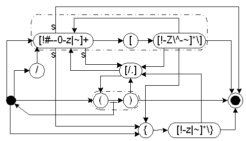

# 1. Introduction

The Unified Code for Units of Measure (UCUM) is a code system intended to include all units of measures being contemporarily used in international science, engineering, and business. The purpose is to facilitate unambiguous electronic communication of quantities together with their units. The focus is on electronic communication, as opposed to communication between humans. A typical application of UCUM are electronic data interchange (EDI) protocols, but there is nothing that prevents it from being used in other types of machine communication.

UCUM is inspired by and heavily based on [ISO 2955-1983](), [ANSI X3.50-1986](), and [HL7’s](http://hl7.org) extensions called “ISO+”. The respective ISO and ANSI standards are both entitled “Representation of \[...\] units in systems with limited character sets” where ISO 2955 refers to SI and other units provided by ISO 1000-1981, while ANSI X3.50 extends ISO 2955 to include U.S. customary units. Because these standards carry the restriction of “limited character sets” in their names they seem to be of less value today, when graphical user interfaces and laser printers are in wide-spread use. For this reason, the European standard [ENV 12435]() in its clause 7.3 declares ISO 2955 obsolete.

ENV 12435 is dedicated exclusively to the communication of measurements between humans in display and print, and does not provide codes that can be used in communication between systems. It does not even provide a specification that would allow communication of units from one system to the screen or printer of another system. The issue about displaying units in the common style defined by the 9th [Conférence Générale des Poids et Mesures]() (CGPM) in 1947 is not just the character set. Although the [Unicode]() standard and its predecessor ISO/IEC 10646 is the richest character set ever, it is still not enough to specify the presentation of units, because there are important typographical details such as superscripts, subscripts, roman and italics.[^1]

1. ISO 2955 and ANSI X3.50 contain numerous name conflicts, both direct conflicts (e.g., `a` being used for both “year” and “are”) and conflicts that are generated through combination of unit symbols with prefixes (e.g., `cd` means candela and centi-day and `PEV` means peta-volt and pico-electronvolt.)

2. Neither ISO 2955 nor ANSI X3.50 cover all units that are currently used in practice. There are many more units in use than what is allowed by the [Système International d'Unités]() (SI) and accompanying standards. For example, the older CGM-units dyne and erg are still used in the science of physiology. Although ANSI X3.50 extends ISO 2955 with some U.S. customary units, it is still not complete in this respect. For example it does not define the degree Fahrenheit.

3. ANSI X3.50 is semantically ambiguous with respect to customary units, even if we do not consider the history and international aspects of customary units. Three systems of mass units are used in the U.S., avoirdupois used generally, apothecaries’ used by pharmacists, and troy used in trade with Gold and other precious metals. ANSI X3.50 has no way to select any one of those specifically, which is bad in medicine, where both apothecaries’ and avoirdupois weights are being used frequently.

ISO 2955 and all standards that do only look for the resolutions and recommendations of the CGPM and the [Comité International des Poids et Mesures]() (CIPM) as published by the [Bureau International des Poids et Mesures]() (BIPM) and various ISO standards (ISO 1000 and ISO 31) fail to recognize that the needs in practice are often different from the ideal propositions of the CGPM. Although not allowed by the CGPM and related ISO standards, many other units are used in international sciences, healthcare, engineering, and business, both meaningfully and some units of questionable meaning. A coding system that is to be useful in practice must cover the requirements and habits of the practice—even some of the bad habits.

None of the current standards attempt to specify a semantics of units that can be deployed in information systems with moderate requirements. Metrological standards such as those published by the BIPM are dedicated to maximal scientific correctness of reproducible definitions of units. These definitions make sense only to human specialists and can hardly be deployed to their full extent by any information system that is not dedicated to metrology. On the other hand, ISO 2955 and ANSI X3.50 provide no semantics at all for the codes they define.

UCUM provides a single coding system for units that is complete, free of all ambiguities, and that assigns to each defined unit a concise semantics. In communication it is not only important that all communicating parties have the same repertoir of symbols, but also that all attach the same meaning to the symbols they exchange. The common meaning must be computationally verifiable. UCUM assumes a semantics for units based on dimensional analysis.[^2]

In short, each unit is defined relative to a system of base units by a numeric factor and a vector of exponents by which the base units contribute to the unit to be defined. Although we can reflect all the meaning of units covered by dimensional analysis with this vector notation, the following tables do not show these vectors. One reason is that the vectors depend on the base system chosen and even on the ordering of the base units. The other reason is that these vectors are hard to understand to human readers while they can be easily derived computationally. Therefore we define new unit symbols using algebraic terms of other units. Those algebraic terms are also valid codes of UCUM.

# 2. Grammar of Units and Unit Terms

### 2.0.1 Preliminaries

1. UCUM consists of a basic set of terminal symbols for units, called atomic unit symbols or unit atoms, and multiplier prefixes. It also consists of an expression syntax by which these symbols can be combined to yield valid units.

2. The tables of terminal symbols are fixed as of every revision of UCUM, additions, deletions or changes are not allowed.

3. All expression that can be derived from these terminal symbols and the expression syntax are valid codes. Any expression of UCUM has precisely defined semantics.

The expression syntax of UCUM generates an infinite number of codes with the consequence that it is impossible to compile a table of all valid units.

That the tables of terminal symbols may not be extended does not mean that missing symbols will never be available in UCUM. Suggestions for additions of new symbols are welcome and revisions of UCUM will be released as soon as a change request has been approved.

### 2.0.2 Full and Limited Conformance

1. The semantics of UCUM implies equivalence classes such that different expressions may have the same meaning.

2. Programs that declare full conformance with UCUM must compare unit expressions by their semantics, i.e. they must detect equivalence for different expressions with the same meaning.

3. Programs with limited conformance may compare unit expressions literally and thus may not detect equivalence of unit expressions.

The option for “limited conformace” allows UCUM to be adopted even by less powerful systems that can not or do not want to deal with the full semantics of units. Those systems typically have a table of fixed unit expression literals that may be related to other literals with fixed conversion factors. Although these systems will have difficulties to receive unit expressions from various sources, they will at least send out valid expressions of UCUM, which is an important step towards a commonly used coding scheme for units.

## 2.1 Character Set and Lexical Rules

### 2.1.1 Character Set        

1. All expressions of UCUM shall be built from characters of the 7-bit US-ASCII character set exclusively.

2. Terminal unit symbols can consist of all ASCII characters in the range of 33–126 (0x21–0x7E) excluding double quotes (`"`), parentheses (`(` and `)`), plus sign (`+`), minus sign (`-`), period (`.`), solidus (`/`), equal sign (`=`), square brackets (`[` and `]`), and curly braces (`{` and `}`), which have special meaning.

3. A terminal unit symbol can not consist of only digits (`0`-`9`) because those digit strings are interpreted as positive integer numbers. However, a symbol `10*` is allowed because it ends with a non-digit allowed to be part of a symbol.

4. For every terminal symbol there is a case insensitive variant defined, to be used when there is a risk of upper and lower case to be confused. Although upper and lower case can be mixed in case insensitive symbols there is no meaning to the case. Case insensitive symbols are incompatible to the case senitive symbols.

The 7-bit US-ASCII character code is the greatest common denominator that can be expected to be available in any communication environment. Only very few units normally require symbols from the greek alphabet and thus the cost of requiring Unicode does not outweigh the benefit. As explained above, the real issue about writing unit terms naturally is not the character set but the ability to write subscripts and superscripts and distinguish roman letters from italics.

Some computer systems or programming languages still have the requirement of case insensitivity and some humans who are not familiar with SI units tend to confuse upper and lower case or can not interpret the difference in upper and lower case correctly. For this reason the case insensitive symbols are defined. Although UCUM does not encourage use of case insensitive symbols where not absolutely necessary, in some circumstances the case insensitive representation may be the greatest common denominator. Thus some systems that can handle case sensitivity may end up using case insensitive symbols in order to communicate with less powerful systems.

ISO 2955 and ANSI X3.50 call case sensitive symbols “mixed case” and case insensitive symbols “single case” and list two columns for “single case” symbols, one for upper case and one for lower case. In UCUM all units can be written in mixed upper and lower case, but in the case insensitive variant the mixing of case does not matter.

White space is not recognized in a a unit term and should generally not occur. UCUM implementations may flag whitespace as an error rather than ignore it. Whitespace is not used as a separator of otherwise ambiguous parts of a unit term.

### 2.1.2 Prefixes

1. Metric units may be combinations of a unit symbol with a prefix symbol.

2. The unit symbol to be combined with the prefix must not itself contain a prefix. Such a prefix-less unit symbol is called unit atom.

3. Prefix and atom are connected immediately without any delimiter. Separation of an optional prefix from the atom occurs on the lexical level by finding a matching combination of an optional prefix and a unit atom.

4. The prefix is the longest leading substring that matches a valid prefix where the remainder is a valid metric unit atom. If no such prefix can be matched, the unit atom is without prefix and may be both metric or non-metric. [1–3: ISO 1000, 3; ISO 2955-1983, 3.7; ANSI X3.50-1986, 3.7 (Rule No. 6).]

### 2.1.3 Square Brackets

1. Square brackets (`[` and `]`) may be part of a unit atom at any place but only as matched pairs. Square brackets are lexical elements and not separate syntactical tokens.

2. Within a matching pair of square brackets the full range of characters 33–126 can be used.[^3]

3. Square brackets do _not_ determine the boundary between prefix and unit atom, but they never span the boundary of unit atoms. 

4. Square brackets must not be nested.

For example `[abc+ef]`, `ab[c+ef]`, `[abc+]ef`, and `ab[c+ef]` could all be valid symbols if defined in the tables. In `ab[c+ef]` either `a` or `ab` could be defined as a prefix, but not `ab[c`.

Square brackets take on one task of round parentheses in HL7’s “ISO+” code, where one use of parentheses is to augment unit symbols with suffixes, as in `mm(Hg)`. Another use is to enclose one full unit symbol into parentheses, as `(ka_u)` (for the King-Armstrong unit of catalytic amount of phosphatase). Apparently, in a unit symbol such enclosed one is supposed not to expect a prefix. Thus, even if `a_u` would have been defined, `(ka_u)` should not be matched against kilo-`a_u`.

Parentheses, however, were also used for the nesting of terms since HL7 version 2.3. At this point it became ambiguous whether parentheses are part of the unit symbol or whether they are syntactic tokens. For instance, `(ka_u)` could mean a nested `ka_u` (where `k` could possibly be a prefix), but also the proper symbol `(ka_u)` that happens to have parentheses as part of the symbol. UCUM uses parentheses for the usual meaning of term nesting and uses square brackets where HL7’s “ISO+” assumes parentheses to be part of the unit symbol.

### 2.1.4 Curly Braces

1. The full range of characters 33–126 can be used within a pair of curly braces (‘{’ and ‘ }’). The material enclosed in curly braces is called annotation.

2. Annotations do not contribute to the semantics of the unit but are meaningless by definition. Therefore, any fully conformant parser must discard all annotations. Parsers of limited conformace should not value annotations in comparison of units.

3. Annotations do, however, signify the end of a unit symbol.

4. An annotation without a leading symbol implies the default unit 1 (the unity).

5. Curly braces must not be nested.

Curly braces are here because people want annotations and deeply believe that they need annotations. Especially in chemistry and biomedical sciences, there are traditional habits to write annotations at units or instead of units, such as `%vol.`, `RBC`, `CFU`, `kg(wet tis.)`, or `mL(total)`. These habits are hard to overcome. Any attempt of a coding scheme to restrict this percieved expressiveness will ultimately result in the coding scheme not being adopted, or just “half-way” adopted (which is as bad as not adopted).

Two alternative responses to this reality exist: either give in to the bad habits and blow up of the code with dimension- and meaningless unit atoms, or canalize this habit so that it does no harm. UCUM canalizes this habit using curly braces. Nevertheless we do continuing efforts to upgrade doubtful units to genuine units of UCUM by defining and linking them to the other units as good as possible. Thus, `g%` is a valid metric unit atom (so that `mg%` is a valid unit too.) A drops, although quite imprecise, is a valid unit of volume `[drp]`. Even HPF and LPF (the so called “high-” and “low-power field” in the microscope) have been defined so that at least they relate to each other.

## 2.2 Syntax Rules

### 2.2.1 Algebraic Unit Terms

1. All units can be combined in an algebraic term using the operators for multiplication (period `.`) and division (solidus `/`).

2. The multiplication operator is mandatory it must not be omitted or replaced by a space. The multiplication operator is a strict binary operator that may occur only between two unit terms.

3. The division operator can be used as a binary and unary operator, i.e. a leading solidus will invert the unit that directly follows it.

4. Terms are evaluated from left to right with the period and the solidus having the same operator precedence. Multiple division operators are allowed within one term. [ISO 1000, 4.5.2; ISO 2955-1983, 3.3f; ANSI X3.50-1986, 3.3f (Rule No. 2f).]

The use of the period instead of the asterisk (`*`) as a multiplication operator continues a tradition codified in ISO 1000 and maintained in ISO 2955. Because floating point numbers may not occur in unit terms the period is not ambiguous. A period in a unit term has no other meaning than to be the multiplication operator.

Since Resolution 7 of the 9th CGPM in 1948 the myth of ambiguity being introduced by more than one solidus lives on and is quoted in all standards concerning the writing of SI units. However, when the strict left to right rule is followed there is no ambiguity, neither with one solidus nor with more than one solidus. However, in human practice we find the tendency to assign a lower precedence to the solidus which misleads people to write $a/b·c$ when they really mean $a/(b·c)$. When this is rewritten as $a/b/c$ there is actually less ambiguity that in $a/b·c$. So the real source of ambiguity is when a multiplication operator follows a solidus, not when there is more than one solidus in a term. Hence, we remove the restriction for only one solidus and introduce parentheses which may be used to remove any perceived ambiguity.

### 2.2.2 Integer Numbers        

1. A positive integer number may appear in place of a simple unit symbol.

2. Only a pure string of decimal digits (`0`-`9`) is interpreted as a number. If after one or more digits there is any non-digit character found that is valid for unit atoms, all the characters (including the digits) will be interpreted as a simple unit symbol.

For example, the string `123` is a positive integer number while `12a` is a symbol.

Note that the period is only used as a multiplication operator, thus `2.5` means 2 × 5 and is not equal to 5/2.

### 2.2.3 Exponents        

1. Simple units may be raised to a power. The exponent is an integer number and is written immediately behind the unit term. Negative exponents must be preceded by a minus sign (`-` positive exponents may be preceded by an optional plus sign (`+`).

2. If the simple unit raised to a power is a combination of a prefix and a unit atom, both are raised to the power, e.g. `1 cm3` equals $10^{-6}m3$ not $10^{-2}m3$. [ISO 2955-1983, 3.5f; ANSI X3.50-1986, 3.5f (Rule No. 4f).]

ISO 2955 and ANSI X3.50 actually do not allow a plus sign leading a positive exponent. However, if there can be any perceived ambiguities, an explicit leading plus sign may be of help sometimes. UCUM therefore allows such plus signs at exponents. The plus sign on positive exponents can be used to delimit exponents from integer numbers used as simple units. Thus, `2+10` means $2^{10}$ = 1024.

### 2.2.4 Nested Terms

1. Unit terms with operators may be enclosed in parentheses (`(` and `)`) and used in place of simple units. Normal left-to-right evaluation can be overridden with parentheses.

2. Parenthesized terms are not considered unit atoms and hence must not be preceded by a prefix.

Up until revision 1.9 there was a third clause “Since a unit term in parenthesis can be used in place of a simple unit, an exponent may follow on a closing parenthesis which raises the whole term within the parentheses to the power.” However this feature was inconsistent with any BNF or other syntax description ever provided, was never used and seems to have no relevant use case. For this reason this clause has been stricken. This is a tentative change. Users who have used this feature in the past, should please comment on this deprecation. If we receive indication that this feature was used by anyone, we would undo the deprecation. If no comments are received, the deprecation continues to take effect.

#### Exhibit 1: UCUM syntax in [Backus-Naur form](https://wikipedia.org/wiki/Backus–Naur_form) (BNF)
| Entity          |     | Expression                                                                                   |
| --------------- | --- | -------------------------------------------------------------------------------------------- |
| `<sign>`        | ::= | `+` \| `-`                                                                                   |
| `<digit>`       | ::= | `0` \| `1` \| `2` \| `3` \| `4` \| `5` \| `6` \| `7` \| `8` \| `9`                           |
| `<digits>`      | ::= | `<digit><digits>` \| `<digit>`                                                               |
| `<factor>`      | ::= | `<digits>`                                                                                   |
| `<exponent>`    | ::= | `<sign><digits>` \| `<digits>`                                                               |
| `<simple-unit>` | ::= | `<ATOM-SYMBOL>` \| `<PREFIX-SYMBOL><ATOM-SYMBOL[metric]>`                                    |
| `<annotatable>` | ::= | `<simple-unit><exponent>` \| `<simple-unit>`                                                 |
| `<component>`   | ::= | `<annotatable><annotation>` \| `<annotatable>` \| `<annotation>` \| `<factor>` \| `(<term>)` |
| `<term>`        | ::= | `<term>.<component>` \| `<term>/<component>` \| `<component>`                                |
| `<main-term>`   | ::= | `/<term>` \| `<term>`                                                                        |
| `<annotation>`  | ::= | `{<ANNOTATION-STRING>}`                                                                      |
#### Figure 1: Pushdown-state automaton describing the syntax

## 2.3 The Predicate “Metric”

1. Only metric unit atoms may be combined with a prefix.

2. To be metric or not to be metric is a predicate assigned to each unit atom where that unit atom is defined.

3. All base units are metric. No non-metric unit can be part of the basis.

4. A unit must be a quantity on a ratio scale in order to be metric.

The metric predicate accounts for the fact that there are units that are prefixed and others that are not. This helps to disambiguate the parsing of simple units into prefix and atom.

To determine whether a given unit atom is metric or not is not trivial. It is a cultural phenomenon, subject to change, just like language, the meaning of words and how words can be used. At one time we can clearly tell right or wrong useage of words, but these decisions may need to be revised with the passage of time.

Generally, metric units are those defined “in the spirit” of the metric system, that emerged in France of the 18th Century and was rapidly adopted by scientists. Metric units are usually based on reproducible natural phenomena and are usually not part of a system of compareable units with different magintudes, especially not if the ratios of these units are not powers of 10. Instead, metric units use multiplier prefixes that magnify or diminish the value of the unit by powers of ten.

Conversely, customary units are in the spirit of the middle age as most of them can be traced back into a time around the 10th century, some are even older from the Roman and Babylonian empires. Most customary units are based on the average size of human anatomical or botanic structures (e.g., foot, ell, fathom, grain, rod) and come in series of comparable units with ratios 1/2, 1/4, 1/12, 1/16, and others. Thus all customary units are non-metric

Not all units from ISO 1000 are metric as degree, minute and second of plane angle are non-metric as well as minute, hour, day, month, and year. The second is a metric unit because it is a part of the SI basis, although it used to be part of a series of customary units (originating in the Babylonian era).

Furthermore, for a unit to be metric it must be a quantity on a ratio scale where multiplication and division with scalars are defined. The [Comité Consultatif d'Unités]() (CCU) decided in February 1995 that SI prefixes may be used with the degree Celsius. This statement has not been made explicitly before. This is an unfortunate decision because difference-scale units like the degree Celsius have no multiplication operation, so that the prefix value could be multiplied with the unit. Instead the prefix at non-ratio units scales the measurement value. One dekameter is 10 times of a meter, but there is no meaning to 10 times of 1 °C in the same way as 30 °C are not 3 times as much as 10 °C. See §§21ff on how UCUM finds a way to accomodate this different use of prefixes at units such as the degree Celsius, bel or neper.

## 2.4 Style

Except for the rule on curly braces (§12), the rules on style govern the creation of the tables of unit atoms not their individual use. Users of UCUM need not care about style rules (§§13–15) because users just use the symbols defined in the tables. Hence, style rules do not affect conformance to UCUM. New submissions of unit atoms, however, must conform to the style rules.

### 2.4.1 Curly Braces

1. Curly braces may be used to enclose annotations that are often written in place of units or behind units but that do not have a proper meaning of a unit and do not change the meaning of a unit.

2. Annotations have no semantic value.

For example one can write `%{vol}`, `kg{total}`, or `{RBC}` (for “red blood cells”) as pseudo-units. However, these annotations do not have any effect on the semantics, which is why these example expressions are equivalent to `%`, `kg`, and `1` respectively.

### 2.4.2 Underscore

1. When in print a unit would have a subscript, an underscore (`_`) is used to separate the subscript from the stem of the unit symbol.

2. The subscript is part of the unit atom.

3. Subscripts are used to disambiguate the two units with the same name but different meanings.

For example when distinguishing the International Table calorie from the thermochemical calorie, we would use 1 calIT or 1 calth in print. UCUM defines the symbols `cal_IT` and `cal_th` with the underscore signifying that “IT” and “th” are subscripts. Other examples are the distinctions between the Julian and Gregorian calendar year from the tropical year or the British imperial gallon from the U.S. gallon (see §31 and §§37ff).

### 2.4.3 Square Brackets

1. Square brackets enclose suffixes of unit symbols that change the meaning of a unit stem.

2. All customary units shall be enclosed completely by square brackets.

3. Other unit atoms shall be enclosed in square brackets if they are very rare, if they will conflict with other units, or if they are normally not used as a unit symbol but do have a proper meaning as a unit in UCUM.

4. Square brackets are part of the unit atom.

For example 1 m H2O is written as `m[H2O]` in UCUM because the suffix H2O changes the meaning of the unit atom for meter (length) to a unit of pressure.

Customary units are defined in UCUM in order to accomodate practical needs. However metric units are still prefered and the customary symbols should not interfere with metric symbols in any way. Thus, customary units are “stigmatized” by enclosing them into square brackets.

If unit symbols for the purpose of display and print are derived from UCUM units, the square brackets can be removed. However, display units are out of scope of UCUM.

### 2.4.4 Apostrophe

1. The apostrophe (`'`) is used to separate words or abbreviated words in a multi-word unit symbol.

2. Since units are mathematically defined symbols and not abbreviations of words, multi-word unit symbols should be defined only to reflect existing habits, not in order to create new ones.

3. Multi-word units should always be enclosed in square brackets.

For example, such legacy units called “Bodansky unit” or “Todd unit” have the unit symbols `[bdsk'U]`, and `[todd'U]` respectively.

# 3. Semantics

### 3.0.1 Preliminaries

1. The semantics of UCUM is defined by the algebraic operations of multiplication, division and exponentiation between units, by the equivalence relations of equality and commensurability of units, and by the multiplication of a unit with a scalar.

2. Every expression in UCUM is mapped to one and only one semantic element. But every semantic element may have more than one valid representant in UCUM.

3. The set of expressions in UCUM is infinite.

### 3.0.2 Equality and Commensurability

1. The set of expressions in UCUM has two binary, symmetric, reflexive, and transitive relations (equivalence relations) “equals” `=` and “is commensurable with” `~`. All expressions that are equal are also commensurable but not all commensurable expressions are equal.

### 3.0.3 Algebra of Units

1. The equivalence classes generated by the equality relation $=$ are called _units_.

2. The set of units $U$ has a binary multiplication operator $·$ that is associative and commutative and has the neutral element $1$ (so called _the unity_). For each unit $u \in U$ there is an inverse unit $u^{-1}$ such that $u · u^{-1} = 1$. Thus, $(U, ·)$ is an Abelian group.

3. The division operation $u / v$ is defined as $u·v^{-1}$.

4. The exponentiation operation with integer exponents $n$ is defined as $un = Π_1^nu$.

5. The product $u' = ru$ of a real number scalar with the unit $u$ is also a unit, where $u' ~ u$.

### 3.0.4 Dimension and Magnitude

1. The equivalence classes generated by the commensurability relation $\sim$ are called _dimensions_. The set D of dimensions is infinite in principle, but only a finite subset of dimensions are used in practice. Thus, implementations of UCUM need not be able to represent the infinite set of dimensions.    

2. Two commensurable units that are not equal differ only by their magnitude.

3. The quotient $u / v$ of any two commensurable units $u \sim v$ is of the same dimension as the unity $(u / v \sim 1)$. This quotient is also equal to the unity multiplied with a scalar $r$: $u / v = r1$, where $r$ is called the _relative magnitude_ of $u$ regarding $v$.

### 3.0.5 Base Units

1. Any system of units is constructed from a finite set $B$ of mutually independent base units $B = \{ b_1, b_2, \dots, b_n \}$, on which any other unit $u \in U$ is defined as $u = r_1b_1^{u_1} · r_2b_2^{u_2} · \dots · r_nb_n^{u_n}$, where $r = r_1 · r_2 \dots r_n$ is called the _magnitude_ of the unit $u$ regarding $B$.

2. With respect to a basis $B$ every unit can thus be represented as a pair $(r, û)$ of magnitude $r$ and dimension $û = ( u_1, u_2, \dots, u_n)$.

3. Two sets of base units are equivalent if there is an isomorphism between the sets of units that they generate.

§19.1 allows to limit the set of supported dimensions. Most practically used units contain exponents of -4 to +4. Thus if memory is limited, 4 bit per component of the dimension vector could be sufficient.

## 3.1 Special Units on Non-Ratio Scales

### 3.1.1 Special Units

1. Those symbols that are used as units that imply a measurement on a scale other than a ratio scale (e.g., interval scale, logarithmic scale) are defined differently. These do not represent proper units as elements of the group $(U,\cdot)$. Therefore those special semantic entities are called _special units_, as opposed to _proper units_. The set of special units is denoted $S$, where $S \cap U = \{\}$.

2. A special unit $s \in S$ is defined as the triple $(u, f_s, f_s^{-1})$ where $u \in U$ is the “corresponding” proper unit of $s$ and where $f_s$ and $f_s^{-1}$ are mutually inverse real functions converting the measurement value to and from the special unit.

3. Although not elements of $U$, special units are said to be “of the same dimension” or “commensurable with” their corresponding proper unit $u$ and the class of units commensurable with $u$. This can be expressed by means of a binary, symmetric, transitive and reflexive relation $\approx$ on $U \cup S$.

The functions $f_s$ and $f_s^{-1}$ are applied as follows: let $r_s$ be the numeric measurement value expressed in the special unit $s$ and let $m$ be the corresponding dimensioned quantity, i.e., the measurement with proper unit $u$. Now, $r_s = f_s(m/u)$ converts the proper measurement to the special unit and $m = f_s^{-1}(r_s) × u$ does the inverse.

### 3.1.2 Operations on Special Units

1. In theory, special units cannot take part in any algebraic operations, neither involving other units, nor themselves (exponentiation) nor involving scalars.

2. Special units are therefore non-metric units.

3. However, due to the requirement of the SI that does allow prefixes on the degree Celsius, special units may be _scaled_ through a prefix or an arbitrary numeric factor.

4. The scale factor $\alpha$ is an additional component of the special unit, which in turn is defined by a quadruple $s = (u, f_s, f_s^{-1}, \alpha)$. When the functions $f_s$ and $f_s^{-1}$ are applied to a measurement value $x$ to convert to and from the special unit the scale factor is applied as follows: $x' = f_s(x) / \alpha$ converts from $x$ expressed in the corresponding proper unit to $x'$ in terms of the special unit and $x = f_s^{-1}(\alpha x')$ does the reverse.

5. Multiplication of a special unit $s = (u, f_s, f_s^{-1}, \alpha)$ with a scalar $\beta$ is defined as $\beta s = (u, f_s, f_s^{-1}, \beta\alpha)$. Multiplication of a special unit $s$ with a dimensionless unit $r1$ is defined as $rs$.

Since prefixes have a scalar value that multiplies the unit atom, a unit must at least have a defined multiplication operation with a scalar in order to be a candidate for the metric predicate. All proper units are candidates for the metric property, special units are no such candidates.

The [Comité Consultatif d'Unités]() (CCU) decided in February 1995 that any SI prefix may be used with degree Celsius. This statement has not been made explicitly before. This is an unfortunate decision because difference-scale units like the degree Celsius have no multiplication operation, so that the prefix value could be multiplied with the unit. Instead the prefix at non-ratio units scales the measurement value. One wonders why the CGPM keeps the celsius temperature in the SI as it is superfluous and in a unique way incoherent with the SI.

The scale factor $\alpha$ is applied with the functions $f_s$ and $f_s^{-1}$ as follows: let $r_s$ be the numeric measurement value expressed in the special unit $s$ and let $m$ be the corresponding dimensioned quantity, i.e., the measurement with proper unit $u$. Now, $r_s = f_s(m/u) / \alpha$ converts the proper measurement to the special unit and $m = f_s^{-1}(\alpha r_s) × u$ does the reverse.

### 3.1.3 Definition of Special Units

1. Special units are marked in the definition tables for unit atoms by a bullet (‘•’) in the column titled “value” and a special expression in the column titled “definition”. The BNF for the special expression is:
  
   `<special-unit> ::= <function-symbol>"("<floating-point-number>" "<term>")"` 
  
   The function symbols are defined as needed.

2. Special expressions are _not_ valid expressions in UCUM, they are _only_ used for defining special units.

## 3.2 Arbitrary Units

### 3.2.1 Preliminaries

1. Arbitrary or procedure defined units are units whose meaning entirely depends on the measurement procedure (assay). These units have no general meaning in relation with any other unit in the SI. Therefore those arbitrary semantic entities are called _arbitrary units+, as opposed to _proper units_. The set of arbitrary units is denoted $A$, where $A \cap U = \{\}$.

2. An arbitrary unit has no further definition in the semantic framework of UCUM.

3. Arbitrary units are not “of any specific dimension” and are not “commensurable with” any other unit.

Until version 1.6 UCUM had dealt with arbitrary units as dimensionless, but as an effect the semantics of UCUM made all arbitrary units commensurable. Since version 1.7 of UCUM, it is no longer possible to convert or compare arbitrary units with any other arbitrary unit.

### 3.2.2 Operations on Arbitrary Units

1. Any term involving arbitrary units, is itself an arbitrary unit and is not comparable with any other arbitrary unit or term.

### 3.2.3 Definition of Arbitrary Units

1. Arbitrary units are marked in the definition tables for unit atoms by a bullet (‘•’) in the column titled “value” and a bullet in the column titled “definition”.

# 4. Tables of Terminal Symbols

## 4.1 Prefixes

1. Prefix symbols are those defined in Table 1.

2. There are five columns titled “name,” “print,” “c/s,” “c/i,” and “value” The name is the full (official) name of the unit. The official symbol used in print is listed in the column “print.” Columns “c/s,” and “c/i” list the symbol in the case sensitive and the case insensitive variants respectively. “Value” is the scalar value by which the unit atom is multiplied if combined with the prefix.

3. Only the columns titled “c/s,” “c/i,” and “value,” are normative. Full name and print symbol are defined by the CGPM and are out of scope of UCUM.

The case insensitive prefix symbols are slightly different from those defined by ISO 2955 and ANSI X3.50, where “giga-,” “tera-,” and “peta-” have been `G`, `T`, and `PE`. UCUM has a larger set of unit atoms and needs to prevent more name conflicts. Tera and giga have a second letter to be safe in the future. The change of `PE` to `PT` would be the way to go for ISO 2955 which currently has a name conflict (among others) with peta-volt and pico-electronvolt.

The new prefixes “yotta-,” “zetta-,” “yocto-,” and “zepto-” that were adopted by the 19th CGPM (1990) have a second letter ‘A’ and ‘O’ resp. to avoid current and future conflicts and to disambiguate among themselves. The other submultiples “micro-” to “atto-” are represented by a single letter to keep with the tradition.

#### Table 1: The prefix symbols

## 4.2 Base Units

1. The base units shown in Table 2 are used to define all the unit atoms of UCUM according to its grammar and semantics.

2. There are five columns titled “name,” “kind of quantity,” “print,” “c/s,” and “c/i.” The name is the full (official) name of the unit. The official symbol used in print this is listed in the column “print.” Columns “c/s,” and “c/i” list the symbol in the case sensitive and the case insensitive variants respectively.

3. Only the columns titled “c/s,” and “c/i,” are normative. Full name and print symbol are defined by other bodies and are out of scope for UCUM.

4. The selection of base units and the particular order are not normative. Any other basis $B'$ that generates an isomorphic group of units is conformant with UCUM.

5. If the other base $B'$ generates a different system of units $U'$ it conforms to UCUM only if there is an homomorphism that maps $U'$ onto $U$.

6. Base units must be metric units only. Special units cannot be base units.

As can be seen the base system used to define UCUM is different from the system used by the [Système International d'Unités]() (SI) The SI base unit kilogram has been replaced by gram and the mole has been replaced by the radian that is defined dimensionless in the SI. Because of the latter change UCUM is not isomorphic with the SI.

The replacement of the kilogram is trivial. In order to bring syntax and semantics in line we can not have a unit with prefix in the base. We need a valid unit of mass before we can combine it with the prefix “kilo-” This change does not have any effect on the semantics whatsoever. The base unit kilogram is one of the oddities of the SI: if the gram would have been chosen as a base units the CGPM could have saved the rather annoying exception of the prefixing rules with the kilogram. At times where we have to multiply the wavelength of excited krypton-86 atoms by 1650763.73 to yield one meter, it seems trivial to divide the prototype of the kilogram by thousand to yield a base unit gram.

The rationale for removing the mole from the base is that the mole is essentially a count of particles expressed in a unit of very high magnitude (Avogadro’s number). There is no fundamental difference between the count of particles and the count other things.

The radian has been adopted as the base unit of plane angle $\alpha$ to facilitate the distinction from the solid angle $\Omega$ by the relation $\Omega = \alpha 2$ and to distinguish rotational frequency $f$ from angular velocity $\omega = 2 \pi ·$ rad $· f$.

#### Table 2: The base units upon which the semantics of all the unit atoms in UCUM are defined. The selection of the base and the order of the units in the base are not normative. Any other base is acceptable as long as there is an isomorphism between the group of units generated by the other base system and this one. All base units are metric.

## 4.3 Derived Unit Atoms

### 4.3.1 Dimensionless Units

1. Dimensionless unit atoms are defined in Table 3.
   
2. There are seven columns titled “name,” “print,” “c/s,” “c/i,” “M,” “value,” and “definition.” The name is the full (official) name of the unit. The symbol recommended for use in print this is listed in the column “print.” Columns “c/s,” and “c/i” list the symbol in the case sensitive and the case insensitive variants respectively. The column “M” specifies whether this is a metric unit. The definition is a valid, case-sensitive expression of UCUM that defines the unit atom.

3. Only the columns titled “c/s,” “c/i,” “M,” “value,” and “definition” are normative. Full name and print symbol are out of scope of UCUM.

4. The units named “parts per $N$” are provided to be used where absolutely necessary but are not endorsed. Especially “ppb” and “pptr” are deprecated since “billion” and “trillion” are ambiguous names internationally. The explicit powers of ten should be given instead.

#### Table 3: Dimensionless units. The units ppb and ppt are deprecated because the names “billion” and “trillion” are ambiguous. The expression “10*-9” or “10*-12” should be used instead. When the units percent or “parts per $N$” are used for concentrations specific units are prefered, e.g., “ug/l” for mass concentration. The expression “ug/kg” for ppb is also valid.

The notation `10*` for powers of ten originated in the HL7 “ISO+“ extension of ISO 2955. In HL7 the character carat (`^`) was thought as reserved. Since most people would expect to see `10^3` for the “third power of ten” and might in fact confuse `10*3` to mean “ten times 3”, the symbol using the carat was later added to UCUM.

### 4.3.2 SI Units

1. SI units are defined by the international [Conférence Générale des Poids et Mesures]() (CGPM). The UCUM definitions for those units are given in Table 4.

2. There are seven columns titled “name,” “print,” “c/s,” “c/i,” “M,” “value,” and “definition.” The name is the full (official) name of the unit. The symbol recommended for use in print this is listed in the column “print.” Columns “c/s,” and “c/i” list the symbol in the case sensitive and the case insensitive variants respectively. The column “M” specifies whether this is a metric unit. The definition is a valid case sensitive expression of UCUM that defines the unit atom.

3. Only the columns titled “c/s,” “c/i,” “M,” “value,” and “definition” are normative. Full name and print symbol are defined by the CGPM and are out of scope for UCUM.

4. The function pair denoted `cel(1 K)` is defined as $f_C(x) = x - 273.15$ to convert from kelvin to degree Celsius, and $f_C^{-1}(x) = x + 273.15$ to convert from degree Celsius back to kelvin.

The case insensitive symbol for pascal is `PAL` which conforms to ISO 2955 and prevents the name conflict between pascal and pico-ampère.

Without reference to history, it is difficult to explain that the degree Celsius is part of the SI, because the degree Celsius is in a unique way incoherent with the SI, and is even superfluous since the base unit kelvin measures the same kind of quantity.

#### Table 4: SI units

### 4.3.3 Other Units from ISO 1000, ISO 2955 and ANSI X3.50

1. Those unit atoms listed by ISO 2955 under the heading “other units from ISO 1000” and some units from ANSI X3.50 are defined in Table 5.

2. The meaning of the columns is declared in §30.2.

3. Only the columns titled “c/s,” “c/i,” “M,” “value,” and “definition” are normative. Full name and print symbol are defined by ISO 1000 and are out of scope of UCUM.

#### Table 5: Other units from ISO 1000, ISO 2955, and some from ANSI X3.50

In the case sensitive variant the liter is defined both with an upper case `L` and a lower case `l`. NIST [63 FR 40338] declares the upper case `L` as the prefered symbol for the U.S., while in many other countries the lower case `l` is used. In fact, the lower case `l` was in effect since 1879. A hundred years later in 1979 the 16th CGPM decided to adopt the upper case `L` as a second symbol for the liter. In the case insensitive variant there is only one symbol defined since there is no difference between upper case `L` and lower case `l`.

The unit “are” competes with year for the symbol “a” not only in ISO 2955, and ANSI X3.50, but also in ISO 1000 as stating the official CGPM approved symbols. This is why the symbol for are is `ar` in UCUM. ISO 2955 explicitly adds the unit atom `ha` for hectare, while “hectare” is just the correct spelling of the compositum of “hecto” and “are” and thus would not require a separate unit atom. Nevertheless, ISO 2955 in its case insensitive variant assigns `ARE` to the are and `har` to the hectare. This is obviously an anomality which UCUM will not follow. As a metric unit, `ar` can be prefixed with `h` to yield `har`.

ANSI X3.50 had two different series of symbols for the units of time, the ones from ISO 2955 as adopted by UCUM and the symbols `yr`, `mo`, `wk`, `hr`, and `sec` while `d` and `min` were defined twice. UCUM does not define these synonyms of ISO 2955 symbols, but does adopt those units from ANSI X3.50 that are not part of ISO 2955, namely `mo` and `wk`. Month and week are useful units mainly in business or clinical medicine.

The semantics of the units of time is difficult to capture. The difficulties start with the day. There is the sidereal and the solar day that depend on the earth’s rotation. The earth’s rotation is variable during one day and is continually slowing down in the long run. The usual subdivisions of the day in 24 hours of 60 minutes and 60 seconds originated in Babylonia. The earth’s rotation was too inexact to measure time, which is why the 11th CGPM (1954) defined the second based on a standarized historical tropical year (see below) which was later (13th CGPM 1967-1968) replaced by frequency measurement. Thus the second came to be the base unit of time and the day is now 864000 s exactly with the [Universal Coordinated Time]() (UTC) adding leap seconds every now and then.

For the year we have to distinguish the “tropical” (solar, sidereal) year from the calendar year. And both are difficult. The tropical year is the year defined by time the earth travels around the sun. This is difficult to measure and varies over time. Around 1900 it was 365.242196 d, currently it is 365.242190 d and around 2100 it will be 365.242184 d. In addition, these durations are averages. The actual length of each year may vary by several minutes due to the gravitational influence of other planets. Thus there is quite a high uncertainty already in the fourth decimal digit.

The calendar year is also difficult because there is the Julian calendar (Sosigenes of Alexandria and Julius Caesar, 45 BC) with a slightly too long year of 365.25 d that causes the calendar to be one day ahead of the tropical year in 128 years. The Gregorian calendar (Christopher Clavius 1537-1612 and Pope Gregory XIII 1545-1563) leaves out three leap years in 400 years (let $n$ be the year number, the leap year is dropped if $n \bmod 100 = 0$ but not $n \bmod 400 = 0$.) The Gregorian mean year is thus 365.2425 d. This leap year arithmetic seems to be too much even for astronomers, which is why the light year ends up being defined based on the Julian year [NIST Sp. Pub. 811, 1995 Edition]. For this reason, UCUM defines Tropical, Julian, and Gregorian year by means of subscripts, but assigns the default year symbol to the Julian year.

The week is 7 days, this is a biblic truth we can count on (it is actually quite plausible that the week of seven days originated in Babylonia and entered Jewish tradition during the Babylonian exile.)

The difficulty continues with the month. The lunar (so called “synodal”) month is variable. Around 1900 it was 29.5305886 d currently it is 29.5305889 d and in 2100 it will be 29.5305891 d, which we fixate in the 5th decimal digit with a considerable uncertainty. The calendar month is difficult because of the uneven distribution of days in a month over the year, and because of the two different calendar years. But we will usually use the mean calendar month, which is the Julian calendar year divided by 12.

As a conclusion, great care has to be taken when the “customary units” of time are used to measure time. The SI has fixated the second which should be used whenever accuracy is required. For business purposes the Julian calendar is sufficient especially since the notion of the Workday (versus Holiday) is more important than the imprecision over 128 years. [Sources: “Calendar” [Britannica](https://www.britannica.com/science/calendar). [Claus Tondering, Frequently asked questions about calendars](https://www.tondering.dk/claus/calendar.html). Part 1. 1998.]

### 4.3.4 Natural Units

1. Fundamental constants of nature and units derived from these constants are defined in Table 6.

2. The meaning of the columns is declared in §30.2.

3. Only the columns titled “c/s,” “c/i,” “M,” “value,” and “definition” are normative. Full name and print symbol are defined by ISO 1000 and are out of scope UCUM.

#### Table 6: Natural units

This list is not complete. It does not list all constants but only those that are fundamental and from which many other constants can be derived. The source of this table is [The NIST Reference on Constants, Units, and Uncertainty](http://physics.nist.gov/cuu/Constants/index.html) Version 2.1, 21 May 1998. NIST Physics Laboratory.

In the base system of UCUM, the general gas constant $R$ is identical to the Boltzman constant $k$. In the SI both are related through $R = k × N_A$, where $N_A = 6.0221367 × 10^{23}$ /mol is the Avogadro constant. Because UCUM defines the mole to be the dimensionless Avogadro number (number of particles in 1 g of 12C itself), there is no difference anymore if the Boltzman constant is given as $k = 1.380658 × 10^{23}$ J/K or $R$ = 8.314511 J mol-1 K-1.

### 4.3.5 CGS Units

1. The units of the older [Centimeter-Gram-Second]() (CGS) system are defined in Table 7.

2. The meaning of the columns is declared in §30.2.

3. Only the columns titled “c/s,” “c/i,” “M,” “value,” and “definition” are normative. Full name and print symbol are out of scope for UCUM.

#### Table 7: CGS units

Although the CGPM “accepts” only very few CGS units “for use with the SI,” CGS units are proper metric units. CGS units are still used in many physiological laboratories and in clinical diagnostics (e.g., cardiology). In addition CGS units ackquired a special dignity as this was the system of units used by the great physicists of the early 20th Century, Albert Einstein, Max Planck, and many others who worked on the scientific revolution that had quite a cultural impact.

The CGS system defined electric and magnetic phenomena differently which is why the units named “oersted” and “maxwell” have no proper SI counterpart. This table was compiled from various sources and is not complete and not very systematic. We therefore welcome suggestions and advice as to how this table could be completed.

## 4.4 Customary Unit Atoms

Customary units have once been used all over Europe. Units were taken from nature: anatomical structures (e.g., arm, foot, finger), botanical objects (e.g., grains of various sorts, rod), or processes of everyday life (e.g., amount of land one could plow in a morning, the length of 1000 steps, an hour of walking, etc.).

Many of these units can be traced back in history to the Romans (mile), Greeks (carat), and even more ancient times. It is thus no wonder that this heritage was in some way ordered. Indeed, one finds the same names for units used in different countries and most of these units where divided into smaller or multiplied to larger units in the same way.

For example, there was the foot (de. “Fuß” fr. “pied” nl. “voet”) that was divided into 12 inches (de. “Zoll” fr. “pouce”). An inch was divided into 12 lines (de. “Linie” fr. “ligne” ). Two feet was one ell (de. “Elle” da. “Alen” sv. “Aln”). The ell was, however, not very popular in England, as opposed to the rest of Europe. Conversely, the yard is hard to find elsewhere, aside from the Argentinian “vara.” But it is perhaps no accident that the meter ended up as the $40 × 10^{-6}$ of an earth’s meridian, which is approximately one yard ($43.7 × 10^{-6}$). The rod (de. “Rute” fr. “perche” nl. “roede” sv. “stång”) was very popular all over Europe and so was the fathom (de. “Klafter”).

The square rod (de. “Quadratrute” fr. “perche-carrée” nl. “vierkante-roede” was mainly used to measure land. The acre as the legnedary land to sow in one morning (or day) is also widespread (de. “Morgen, Tagwerk, Acker” fr. “arpent” sv. “tunnland” , although the exact amount in square rod varies considerably from region to region. Interestingly, even the special purpose measures such as the “hand” for measuring horses have international equivalents (de. “faust”).

One can indeed say that there was once a “système international d'unités coutumières“ but the magnitudes of the units were not standardized internationally. Of course, Great Britain had the most impact in standardizing the customary system, because of its colonies, including its most important colony, America. However, after the customary units were established in the U.S. a major reform took place through the [British Weights and Measures Act of 1824](https://www.legislation.gov.uk/ukpga/Geo4/5/74/contents/enacted). For instance, Queen Anne’s wine Gallon of 231 cubic inches, still used in the U.S., was discarded then, and the older bushel was standardized differently in Great Britain. Other deviations between the English and U.S. measures are due to various alignments with the metric system. Thus, in the U.S., the yard was standardized as 3600/3937 m and the inch was 2.540005 cm while in England the inch was still 2.539998 cm.

In 1959 major parts of the U.S. and British system of customary units were standardized internationally, again aligned to the metric system which is why the international yard is 0.9144 m exactly and the nautical mile became 1852 m exactly. However, traditional subdivisions and multiples have not been abolished in favor of the international standard. Furthermore the old U.S. standard for the yard is still legally used for land surveying.

Conclusively, there are different systems of customary units that are in use today. These systems use the same names for units that have different equivalents in the metric system, because the customary systems are based on different reference quantities but multiples and subdivisions of the reference quantities are very similar, though with notable exceptions.

In the following tables we tried to give the original definitions to the customary units. This means in general that the references to the metric system are as few as possible, with most of the units of one system defined as multiples and subdivisions of one reference unit.

We use the subscript notation to disambiguate units with same names in the different systems. Subscript notation means, for instance that if the print symbol for foot is “ft” we use subscripts to distinguish the international foot “fti” the U.S. survey foot “ftus” and the British Imperial foot “ftbr” We do not actually list print symbols for customary units, because there seems to be no standard for it, and because defining print symbols is out of scope for UCUM. However, we presume that subscripts be used to disambiguate whatever print symbols are being used. According to §§13ff, UCUM uses the underscore to denote those subscripts, and also encloses the entire unit atom into square brackets. Hence, the symbols for the international foot, the U.S. survey foot, and the British Imperial foot are defined as `[ft_i]`, `[ft_us]`, and `[ft_br]` respectively.

Prospective users of UCUM may be disappointed by the fact that there are many different symbols for foot and inch defined but all of them have a subscript and thus none of them are equal to the ANSI X3.50 symbols. We considered to define default symbols for customary units, where, e.g., the common units of length (foot, inch) would default to the international customary units, while mass units (pound, ounce) would default to the avoirdupois system. However, because the customary system is quite complex, and units by the same names can differ by more than 20%, defining defaults will probably cause even more confusion. There is no denial: a gallon is not just a gallon and a pound is not just a pound, this is the disadvantage of dealing with a unit system of medieval origin.

### 4.4.1 International Customary Units

1. The unified U.S. and British Imperial customary units, so called “international” customary units are defined in Table 8.

2. The meaning of the columns is declared in §30.2. With the exception that the column named “print” is not available.

3. Only the columns titled “c/s,” “c/i,” “M,” “value,” and “definition” are normative. The full name is out of scope UCUM.

4. The special symbols for “square inch,” “cubic foot,” etc. are deprecated. The preferred expressions use the exponents 2 and 3 respectively as shown in the column “definition.”

#### Table 8: International customary units

In general, the international customary units are effective in the U.S. and in Great Britain since 1959. We are unsure, however, about this in countries that formerly or at present belong to the Commonwealth. We therefore appreciate advice and reference to original sources on this transition. Conceivably other countries may have made exceptions in the transition to the international definitions of customary units, such as the U.S. where the old definitions have been retained for the purpose of land surveying.

It is not quite clear exactly what units the international customary system comprises. According to [Encyclopedia Britannica](https://www.britannica.com) [British Imperial System. Britannica Online], the rod was removed in Great Britain in 1963. Since the definition of the acre is based on the rod, we did not include rod and acre in the international customary system. In the U.S. the acre is still defined on the older U.S. customary system as of 1893.

In general, we did not include special customary units of area and volume in Table 8, since these are still used differently in the U.S. Special symbols such as suqare inch and cubic foot have been included according to ANSI X3.50. Generally the “square-” and “cubic-” prefixes are unnecessary in ISO 2955 and ANSI X3.50 and are deprecated by UCUM. We placed the board foot, cord and circular mil into the international table because these units are suggested by ANSI X3.50 but we were not sure in what sense they are still used. We did, however, not include the square mile in the international table because in the U.S. measurements in square miles are most likely based on the survey mile that is part of the older system, see §35.

The circular mil is exactly the area of a circle with a diameter of one mil. One mil, in turn, equals 1/1000 inch (“mil” is the etymological equivalent of “milli-inch” ) The mil has been defined in Table 8 to support the exact definition of the circular mil.

ANSI X3.50 does not define a symbol for the “hand,” but this unit is mentioned in the table given by Encyclopedia Britannica. The hand is used in measuring the height of horses from foot to shoulder. It was probably not subject to the internationalization of customary units. Any advice as whether the hand is used based on an older British or U.S. definition is appreciated.

### 4.4.2 U.S. Survey Lengths

1. The older U.S. units according to the definition of the inch in the U.S. Metric Law of 1866 and the definition of foot and yard that was valid from 1893 until 1959.

2. The meaning of the columns is declared in §34. [Barry N. Taylor, Guide to the Use of the International System of Units (SI) [NIST Special Publication 811](https://physics.nist.gov/cuu/pdf/sp811.pdf), National Institute for Standards and Technology (NIST), 1995.]

#### Table 9: Older U.S. “survey” lengths (also called “statute” lengths)

After the 1959 international agreement changed the definition of the yard in the U.S. to be 0.9144 m exactly, surveyors, and civil engineers complained that volumnious legacy surveys and so forth used the previous definition of (1200/3937) m and that this change would be disruptive. So, by statute, Congress created a survey foot of (1200/3937) m (the old 1893 Mendenhall Order definition). Thus, by statute, miles used in surveying are referred to as statute miles of 5280 survey feet each. The fathom, rod, and furlong are likewise based on the survey foot.

According to NIST, the acre as normally used in the U.S. is defined in terms of U.S. survey lengths, and not in terms of the international custormary system. This older U.S. customary system of survey lengths is still used for geodesic measurements.

### 4.4.3 British Imperial Lengths

1. Table 10 defines symbols for the older British Imperial lengths as of the British Weights and Measures Act of 1824.

2. The meaning of the columns is declared in §34.

#### Table 10: British Imperial lengths

The older British Imperial system is predominantly of historical interest. However, it may be that some former members of the Commonwealth have retained this system after 1959, when the unified international definitions where established, and after 1963, when the British system was revised in England.

The chain was proposed by Edmund Gunter in England of the 17th century. It is possible that Gunter’s chain and Ramden’s chain are related to other European traditional units such as the English “rope” (measuring 20 feet) or the old German “Landseil” (measuring 52 ells or 104 feet) named after ropes or chains that could be spanned in order to measure land. The difference in the definitions of those units is no surprise as there is nothing that restricts a chain or rope to a praticular length. However, these units are still similar in magnitude.

### 4.4.4 U.S. Volumes

1. The U.S. volumes, so called “capacity” measures, which are different for fluid goods (wine) and dry goods (grain), are defined in Table 11.

2. The meaning of the columns is declared in §34.

#### Table 11: U.S. volumes including so called “dry measures”

The U.S. fluid volumes have been defined based on Queen Anne’s wine gallon which was in turn defined exactly as 231 cubic inch. Although we used international inch, we are not sure what inch definition is actually used for defining the exact size of a U.S. gallon. However, the differences between the various inches are minimal, even when raised to the 3rd power (i.e., the difference between the U.S. inch and the British Imperial inch remains in the sixth decimal digit.)

Dry measures are based on the bushel (corn bushel), originally defined in 1701 as “any round measure with a plain and even bottom, being 18.5 inches wide throughout and 8 inches deep.” This definition, being $(18.5/2)^2 \pi × 8 = 2150.42017138221...$ cubic inch was later truncated to 2150.42 cubic inch exactly. At times the bushel was closely related with the Winchester gallon (corn gallon), which has been mentioned as an historical curiosity.

ANSI X3.50 defines symbols for the units cup, tablespoon and teaspoon which are predominantly used in cooking recipies but also in practical medicine. Similar units can often be found in European cook books, but are usually translated into metric units outside the U.S. For practical medicine these are still very handy units to give instructions to patients.

### 4.4.5 British Imperial Volumes

1. British Imperial volumes according to the Weights and Measures Act of 1824 are defined in Table 12.

2. The meaning of the columns is declared in §34.

#### Table 12: British Imperial volumes

The British Weights and Measures Act of 1824 removed the medieval distiction between wine and grain measures and defined one unified system of volumes based on a new Gallon that was defined similarly as the metric unit liter: “10 imperial pounds weight of distilled water weighed in air against brass weights with the water and the air at a temperature of 62 degrees of Fahrenheit’s thermometer and with the barometer at 30 inches.”

With the current definition of the gallon as 277.421 cubic inches (approximately) and a density of water of 0.99878 kg/l according to NIST data, the inch must have been approximately 2.5371 cm at that time. Because of this difficulty with the original definition of the British gallon we based the British Imperial volumes on the gallon for which there is an exact metric equivalence, according to NIST, which provides usually well researched data.

Note that the subdivisions of the British Imperial system of volumes differs from the U.S. system of fluid volumes between gill and fluid ounce: in the British system 1 oz fl equals 1/5 gill where in the U.S. system 1 oz fl equals 1/4 gill. Thus, although the british system starts out with a 20% larger gallon, the British fluid ounce, fluid dram and minim are 4% smaller than the U.S. units with the same name.

### 4.4.6 Avoirdupois Weights

1. The avoirdupois system of mass units is defined in Table 13.

2. The meaning of the columns is declared in §34.

#### Table 13: Avoirdupois weights

The avoirdupois system is used in the U.S. as well as in coutries that use the British Imperial system. Avoirdupois is the default system of mass units used for all goods that “have weight” (fr. avoir du poids). Interestingly all three systems of weight are based on the same grain of barley, standardized to 64.79891 mg exactly [NIST].

### 4.4.7 Troy Weights

1. The troy system of mass units is defined in Table 14.

2. The meaning of the columns is declared in §34.

#### Table 14: Troy weights

The troy system originates in Troyes, a City in the Champagne (France) that hosted a major European fair. The troy system was later used for measuring precious metals. The World Monetary Fund valued all currencies against the troy ounce of gold at least until the 1960s (advice appreciated). The troy ounce is still used in worldwide trade with gold, even in countries that otherwise use metric units (de. “feinunze”). The troy system retains the original Roman subdivision of the pound in 12 ounces. The Roman _uncia_ was “one twelfth” of a _libra_ (hence the symbol “lb” for the pound), just as the inch (also originating from la. “libra” is one twelfth of a foot. The subdivision of 12 ounces/inches per pound/foot and 2 foot per ell (la. “cubit”) apparently originated in the ancient Egypt and was carried on by the Greeks and Romans into the medieval Europe. However, there was always an ambiguity such that the subdivision of 1/12 could become 1/16 and vice versa, hence the avoirdupois ounce of 1/16 pound.

Note also that the troy pound was [abolished in England](https://en.wikipedia.org/wiki/Pound_(mass)#Troy_pound) on January 6, 1879.

### 4.4.8 Apothecaries’ Weights

1. The apothecaries’ system of mass units is defined in Table 15.

2. The meaning of the columns is declared in §34.

#### Table 15: Apothecaries’ weights

Note that some U.S. pharmacies still use this system of apothecaries’ weights when measuring the amount of drugs. This system is very different from the avoirdupois system though based on the same grain. The apothecaries’ dram is more than twice as much as the avoirdupois dram, the ounce is still 10% greater than the avoirdupois ounce while the pound is 20% less than the avoirdupois pound. The apothecaries’ system, just as the troy system, keeps the original Roman subdivision of an ounce (la. “uncia”) to be 1/12 pound (la. “libra”). Hence is the apothecaries’ pound about 22% smaller than the avoirdupois pound, while its subdivisions are greater than the respective avoirdupois subdivisions (ounce 10%, dram 119%). This difference in the weight systems is the most important reason why ANSI X3.50 should not be applied in medicine, where both systems are being used and therefore misinterpreations are inevitable.

#### 4.4.9 Typesetter’s Lengths

1. The units of length as used in typesetting are defined in Table 16.

2. The meaning of the columns is declared in §34.

#### Table 16: Units used in typesetting

There are three systems of typesetter’s lengths in use today: Françcois-Ambroise Didot (1730-1804), a publisher in Paris, invented this system based on the traditional subdivisions of the customary units: 1 line was 1/12 inch and 1/6 line was one point. Henceforth the size of letters were measured in point. However, the Didot system is based on the _pouce_, i.e. the french inch, which, just as the English inch, is 1/12 _pied_ (foot). But the French foot was about 6.5% greater than the British Imperial foot. In the Anglo-American realm the typesetter’s point was based on the British Imperial inch, with the same subdivisions. However, in the type foundries’ industry the original definition of a point drifted apart, and in the late 19th century U.S. type foundries reestablished a slightly (0.375%) greater standard point. This point made its way back to the British. However, recently, the computer typesetting industry readjusted the point to its original size of 1/72 inch. All three systems, however, are still being used today.

## 4.5 Other Legacy Units

### 4.5.1 Legacy Units for Heat and Temperature

1. Older units of heat (energy) and temperature are defined in Table 17.

2. The meaning of the columns is declared in §30.2.

3. Only the columns titled “c/s,” “c/i,” “M,” “value,” and “definition” are normative. Full name and print symbol are either not standardized or standarized by other bodies and are out of scope for UCUM.

4. The function pair denoted `degf(5 K/9)` is defined as $f_F(x) = 9/5 x - 459.67$ to convert from kelvin to degree Fahrenheit, and $f_F^{-1}(x) = 5/9 (x + 459.67)$ to convert from degree Fahrenheit back to kelvin.

5. The function pair denoted `degre(5 K/4)` is defined as $f_{Ré}(x) = 4/5 x - 218.52$ to convert from kelvin to degree Réaumur, and $f_{Ré}^{-1}(x) = 5/4 (x + 218.52)$ to convert from degree Réaumur back to kelvin.

#### Table 17: Other Units for Heat and Temperature

The degree Fahrenheit was missing in ANSI X3.50. HL7’s “ISO+/ANS+” code defined the degree Fahrenheit under the symbol `DEGF` which is reflected here. This is the reason why UCUM does not define a new symbol `Fah` similar to `Cel` of ISO 2955 for the degree Celsius.

Defining precise semantics for legacy units for “quantity of heat” is difficult. The many variants of these units are frequently confused because there is not just a calorie and not just a british thermal unit. The different calories usually being used vary by 1% but the confusion can result in an error as high as 100000%! Thus, if exactness and non-ambiguity is important one should use the joule to report amounts of heat, just like for any other energy and work kind-of-quantities.

The gram-calorie, sometimes called “small calorie” is defined as the amount of heat required to raise the temperature of 1 gram of water from 14.5 °C to 15.5 °C. According to [Encyclopedia Britannica](https://www.britannica.com), this is the calorie most often used in engineering. There is also a less frequently used gram-calorie at 19.5 °C to 20.5 °C and a mean calorie that is 1/100 of the amount of heat required to raise the temperature from 0 °C to 100 °C. The _International Table_ calorie is defined by the [International Conference on the Properties of Steam]() (1956) and is used in steam engineering. In chemistry a “thermochemical” calorie is used for reaction enthalpies.

To complete the confusion, there is also a kilogram-calorie (“large calorie”), that has a similar definition based on a kilogram instead of a gram of water. This kilocalorie has also been called “calorie” in the sloppy speech of everyday life about food. U.S. “Nutrition Facts” that label almost every American food say “Calories: xxx” [The International Union of Nutritional Sciences]() recommends using either the joule or a kilocalorie based on the thermochemical calorie. Because of a perceived popular demand UCUM defines the nutrition Calorie as `Cal` with the conventional captital first letter. For the case insensitive variant of UCUM, the symbol is enclosed in square brackets (`[CAL]`).

Only the International Table calorie and the thermochemical calorie have exact definitions. To give some guidance in the confusing plenty of different calories, UCUM defines a default symbol `cal` as an alias for the thermochemical calorie, because the calorie is mostly used today in medicine and biochemistry. On the other hand, we consider engineers smart enough to select the precise calorie they mean.

Similar to the calories, various “British Thermal Unit” (Btu) are defined and the confusion continues. One Btu is defined as the amount of heat necessary to raise the temperature of one avoirdupois pound of water by one degree Fahrenheit beginning from various temperatures (39 °F, 59 °F, or 60 °F). There is also the International Table Btu and the thermochemical Btu. Just as with the calorie we define a default symbol `Btu` as an alias for the thermochemical Btu.

### 4.5.2 Units Used Predominantly in Clinical Medicine

1. Units used mainly in clinical medicine are defined in Table 18.

2. The meaning of the columns is declared in §34.

3. The function pair denoted `hpX(1 l)` is defined as $f_{hp\ X}(x) = -\ lg\ x$ to convert from a number fraction (dillution) per liter to the homeopathic potency value of the decimal (X) series, and $f_{hp\ X}^{-1}(x) = 10^{-x}$ to convert from the potency value back to the number fraction. Likewise, the function pair denoted `hpC(1 l)` is defined as $f_{hp\ C}(x) = -\ ln(x) / ln(100)$ to convert from a number fraction (dillution) per liter to the homeopathic potency value of the centesimal (C) series, and $f_{hp\ C}^{-1}(x) = 100^{-x}$ to convert from the potency value back to the number fraction. Aanalogous functions are defined for the millesimal (M) series with basis 1,000 and the series and the quintamillesimal (Q) series with basis 50,000.

4. The function pair denoted `100tan(1 rad)` is defined as $f_{PD}(\alpha) = \tan(\alpha) * 100$ to convert from a plane angle α to a prism diopter value (or a slope percent value) and $f_{PD}^{-1}(x) = \arctan(x / 100)$ to convert from prism diopter (or slope percent) value $x$ back to a plane angle.

#### Table 18: Units Used Predominantly in Clinical Medicine

Clinical medicine all over the world still uses mm Hg to measure arterial blood pressure, and often the instruments used are real mercury columns. Likewise, the central venous blood pressure is often measured using simple water columns which is very practical for the routine. The units m H2O and m Hg are metric units even though they are “not accepted” for use with the SI for quite a while. Although more and more hospitals in Europe switch to using the pascal to measure partial pressures in blood gas analysis, the older units will not vanish any time soon.

In the U.S. the inch is sometimes used instead of the millimeter, and because the inch is non-metric the inch of mercury or water columns is non-metric as well.

The peripheral vascular resistance unit is the vascular resistance on which a perfusion pressure of 1 mm Hg causes a flow of 1 ml/s.

The “mesh” occurs in the NIST Guide to the SI. It seems like it is the customary counterpart of the diopter.

The unit “charrière” originates from a French manufacturer of medical instruments by that name. One charrière is the gauge of a catheter with a circumference of approximately 1 mm such that it is by convention exactly one third of a millimeter. In the U.S. the charrière is simply called “french.”

#### NOTE: Note that UCUM versions prior to 1.9 defined this unit as 1/π, this use, however this was never common use of the unit. This is why the definition has been corrected instead of adding another one.

A drop is a variable amount of fluid and depends on the device and technique used to produce the drop and on the physical properties of the fluid. This is similar to units like cup, tablespoon, and teaspoon that depend on the spoon or cup and are not exact either. However, in clinical medicine medication is dispensed by drops and unlike a “tablet” a drop refers to a real physical kind of quantity, volume, though not very exact.

#### NOTE: Note that UCUM versions prior to 1.9 defined this unit as mL/12, this use, however this was not common use of the unit. This is why the definition has been corrected instead of adding another one. Typically it is stated as mL/20. Original research using a 20 mL syringe filled to 5 mL shows that 1 mL has 25 drops of water, when tensides are added, the number goes up to 45. A saturated saline solution required 30 and plant oil 35. The speed of dropping, pressure and position of the syringe or the lumen of the outlet, open or partially clogged with wax, did not have a significant influence on the number of drops. While the original research suggests that the division should be by 25 or more, we use the common notion. It is discouraged to use the drop as any standard unit.

The Hounsfield unit is a unit of X-ray attenuation used in evaluating CT scans. It is defined on an interval scale where air is -1000 HF, water is 0 HF and bone is +1000 HF. Any advice as to how this unit can be related to metric units of radiant intensity decremence is appreciated.

We have always pointed out that the homeopathic teaching takes potency not as equivalent to dillution and the C and X series would not equate to each other in the strictly numerical manner. Homeopathic potency includes the “agitation” (a vigorous shaking) that needs to occur in every step of the dilluting process. Therefore as of April 2010, the hoemeopathic units are declared “arbitrary units,” that is, they are no longer convertible. Therefore, also, we discontinue defining them using the dillution functions. The dillution functions sometimes cause truly astronomical values, leading to overflow conditions, e.g. in such potencies as 30 C or 100 X or 10 M, which do actually occur in hoemeopathics that are on the market. The previous units continue to exist as “retired,” but their symbols now have a prime (apostrophe) in them.

### 4.5.3 Chemical and Biochemical Units

1. Units used mainly in chemical and biochemical laboratories are defined in Table 19.

2. The meaning of the columns is declared in §43.

3. The function pair denoted `ph(1 mol/l)` is defined as $f_{pH}(x) = -\ lg\ x$ to convert from moles per liter to the pH value, and $f_{pH}^{-1}(x) = 10^{-x}$ to convert from the pH value back to moles per liter.

#### Table 19: Units used in Chemical and Biomedical Laboratories

The amount of electrolytes (including acids and bases) is often reported as equivalents instead of amount of substance. This habit originates in the measuring technique of titration. UCUM does not endorse using equivalents. We rather recommend to calculate the proper amount of substance after titration, so that 1 eq of Na+ ions is 1 mol, but 1 eq of Ca++ ions is 0.5 mol. The problem with equivalents is that the measurement results are difficult to compare because their magnitude depends on the degree of ionization of the substance. That is to say, the meaning of equivalents depend not only on the substance, but also on the state that the substance is in. For example, in iron we have to distinguish Fe2+ from Fe3+, so that no one can be sure how much 1 eq of iron really is.

Degrees of acidity are normally measured as “the pH value” that is the negative decadic logarithmus of the concentration of free protons (or hydronium ions) expressed in 1 mol/l. Usually the pH value is considered a dimensionless quantity. With the semantics of special units (§§21ff). UCUM can link the pH value tighter to the system of proper units. Thus `[pH]` is defined as a unit symbol with the corresponding unit 1 mol/l. This allows conversions between pH and concentrations, and&mdash;because UCUM identifies the mole with the Avogadro number&mdash;can be converted to an absolute number of protons: for example, pH 7.4 converts instantly to 0.04 μmol/l and approximately 23975 protons per picoliter.

The unit osmol as the amount of dissolved particles is to be used with caution because it interferes with “osmolar” which is the amount of dissolved particles per liter.

The gram-percent (g%) is a metric unit that has the same origin as %vol. Originally it was a dimensionless quanitiy expressing a ratio of two masses and thus equal to 1/100 g/g. Because water is the most important solvent in biochemistry and 1 g of a solution in water has a volume of approximately 1 ml, the meaning of the unit 1 g% drifted towards 1/100 g/ml and farther off to 1 g/dl. That way, the unit 1 g% regained a proper dimension (mass concentration, $M/L^3$). Most often it is used as 1 mg% = 1 mg/dl but all other SI prefixes are possible.

The Svedberg unit S is used to classify macromolecules (e.g., ribosomes) in different phases of a centrifugate.

The units “high power field” (HPF) and “low power field” (LPF) are used in microscopic analysis mostly of urine sediments. These units are used in semi-quantitative estimations of the abundance of things like crystals, bacteria or red and white blood cells. The number of the objects of interest is counted in one view field in the microscope with a 10 times (low) or 100 times (high) magnifying objective lens and then reported as the number per LPF or per HPF respectively. Obviously the number of objects seen depends on the way the slide is prepared: the amount of emulgate dropped, its initial dilution, and the way the drop is smeared. These preparations of the slides are usually carried out with great routine but little exactness, hence LPF and HPF can hardly relate to any exact and meaningful volume.

The best we could do is to define LPF and HPF as areas of the viewed field. However, the area of the field varies with the kind of eyepiece used in the microscope. The so called “field number” of the eyepiece, i.e., the diameter of the view area is typically between 18 mm and 25 mm which is divided by the magnification of the objective lense to yield the actual field diameter $d$. Because the area $A = \pi d^2$, the LPF can be anywhere between 2.5 mm2 and 5 mm2 and the HPF between 0.025 mm2 and 0.05 mm2. Because of this inexactness, we define LPF and HPF as dimensionless quantities with magnitudes that reflect the ratio of the view areas, i.e. 100:1. This allows at least to convert between numbers per LPF and per HPF and vice versa.

The unit “U” of enzymatic activity was defined in 1964 by the [International Union of Biochemistry]() as the catalytic activity that catalyzes the transformation of 1 μmol of the substrate per minute. This unit is defined so that normal biological enzyme activities are in the range of 1 U-100 U. This unit could not be adopted by the CGPM because it violates the style rules of the SI, i.e. “unit” is a very indistinctive word, “U” is a capital letter, and the definition is not coherent with the SI.

An SI-coherent unit katal 1 kat = 1 mol/s, had been proposed for adoption into the SI over 30 years ago and was finally adopted by the CGPM in 1999. However, perhaps because the unit katal is 7 orders of magnitudes greater than normal catalytic activities, in practice the katal has not gained much in popularity over the unit “U”.

In its 1999 decision to add the katal to the SI, the CGPM explicitly “recommends that when the katal is used, the measurand be specified by reference to the measurement procedure; the measurement procedure must identify the indicator reaction.” The general problem with catalytic activities is that these heavily depend not only on the substance but on many side-conditions, such as temperature, acidity of the solution, presence or absence of cofactors, inhibitors or activators, and the amount of substrate. Particularly a catalytic activity measured _in vitro_ says little about the activity _in vivo_. Hence the use of katal alone without specifying exactly the measurement method, is not sufficient to improve comparability of the measurement of catalytic substances.

Because of the influence of the measurement method, results of biologic activity measurement cannot usually be converted. This is a particular problem with the many named arbitrary units that are still used. UCUM initially defined all arbitrary units as dimensionless. But since this leads to the false conclusion that all arbitrary units are the same, UCUM now accounts for arbitrary units using a special flag. When a unit is marked as arbitrary, it is isolated from all other units, and no result can be converted from and to that unit (See §24).

The unit “TCID50” expresses the result of quantifying an infectious agent in tissue culture. It is a titer, expressing the highest dilution of the specimen which produces a cytopathic effect in 50% of the cell cultures or wells inoculated. [Sources: [Clinical Microbiology Reviews](https://journals.asm.org/toc/cmr/11/3), July 1998, Vol. 11(3), p. 533-554]

The unit “CCID50” expresses the result of quantifying an infectious agent in a cell culture. It is a titer, expressing the highest dilution of the specimen which produces a cytopathic effect in 50% of the cell cultures or wells inoculated. [Sources: Schmidt NJ. Cell culture procedures for diagnostic virology, p. 78-79. In Schmidt NJ, Emmons RW (ed.), Diagnostic procedures for viral, rickettsial and chlamydial infections, 5th ed. American Public Health Association, Inc., Washington, D.C.]

The unit “PFU” measures viral infectivity in a sensitive assay in cell culture where the titer is determined by counting the number of visible plaques developed following viral infection of a sensitive cell culture and results recorded as PFU/ml.

The unit “FFU” measures viral infectivity in a sensitive assay in cell culture, for example, using immunofocus or vital dyes technology. For example, the titer is determined by visualizing infected areas of a cell monolayer by probing with virus-specific antibodies and results are recorded as FFU/ml. [Sources: WHO expert committee on biological standardization (55th Edition). WHO Technical Report #932;]

The unit “BAU” measures amount of an allergen based on an in-vivo callibrated test using the Intradermal Dilution for 50mm sum of Erythema Diameters (ID50EAL) Method. [Source: Turkeltaub PC. Biological Standardization based on Quantitative Skin Testing - The 1D50 EAL Method. Arbeiten aus dem Paul-Ehrlich-Institut, dem Georg-Speyer-Haus und dem Ferdinand-Blum-Institut, Band 80 Gustav Fischer Verlag’ Stuttgart, New York. 1987]

> EDITORIAL NOTE: This method needs to be further investigated to determine a quantitative model which relates that would relate 1 BAU with a standardized amount of substance of the standardized allergenic protein. The situation is not unlike the titer and is not worse than for many of the arbitrary units listed already. In a future revision a stronger formalized metrologic model will be added to this specification.

The unit “AU” (for allergen unit) is for the amount of an allergen based some procedure defined and allergen specific reference standard. Note, do not confuse with astronomical unit, distinguish `[AU]` from `AU`.

The unit “IR” has been defined to measure the allergenicity of an allergen extract. The allergen extract contains 100 IR/ml when, on a skin prick-test using a Stallerpoint&reg;, it induces a wheal diameter of 7 mm in 30 patients sensitized to this allergen, (geometric mean). The cutaneous reactivity of these patients is simultaneously demonstrated by a positive skin prick-test to either 9 % codeine phosphate or 10 mg/ml histamine. The IR unit of Stallergenes is not comparable to the units used by other allergen manufacturers.

> EDITORIAL NOTE: Should more manufacturer specific units come up in the future, we will include a manufacturer abbreviation in the unit symbol.

The unit “Amb a 1 U” is an arbitrary unit for the amount of Amb a 1, a 38 kD glycoprotein that is the major allergen in short ragweed (Ambrosia artemisiifolia) pollen allergen extracts. The amount of Amb a 1 units are determined by an in-vitro comparison of a test short ragweed extract to a FDA CBER Amb a 1 reference standard. Amb a 1 is the up-to-date term for the short ragweed pollen allergen that was originally described as Antigen E. They are synonyms. Although Antigen E is no longer used in the scientific literature, its meaning is unambiguous. The manufacturers are still licensed to use Antigen E as the designation. Therefore, Amb a 1 U = AgE U. There is an empiric relationship between Amb a 1 U and BAU (350 Amb a 1 U/mL = 100,000 BAU/mL). It was based on studies done decades ago on 15 study subjects. FDA’s CBER considered mandating a conversion to BAU/mL in the labeling of short ragweed pollen products, based on AgE content, but this was never implemented. CBER provides two US standard reagents to manufacturers for their determination of Amb a 1 content, a reference standard and a reference serum. The assay used is a radial immunodiffusion assay (RID). Solid references discussing the relationship between Antigen E U/mL/Amb a 1 U/mL and micrograms of Antigen E U/mL/Amb a 1/mL are being researched.

> EDITORIAL NOTE: The University of Texas’ Structural Database of Allergenic Proteins (SDAP) contains close to 1000 allergens, isoallergens. Comparing the prospect of thousands of such special units for every allergen, one begins to appreciate even the metrologically comlex BAU unit.

The unit “PNU” is defined as follows: 1 PNU/ml is equivalent to $1 x 10^{-5}$ mg of nitrogen determined to be in the material precipitated from 1 ml of allergenic extract by phosphotungstic acid (micro-Kjeldahl method). Typically, 1 mg of protein nitrogen equals 100,000 PNU. The unit “PNU” is an old protein unit unrelated to SI units. Several hundred products, from several manufacturers, are labeled in PNUs, and a switch to SI units for protein content is impractical.

The unit “Lf” is called the “Limit of Floculation” or “limes flocculationis”. It is based on an antigen-antibody precipitation reaction and used for the quantification of the antigenic content of tetanus and diphteria toxin and toxoid. The limes flocculationis is the smallest amount of antigen that when mixed with one unit (Ramon) of antitoxin (antibody), produces the most rapid floccules in the flocculation test. For a purified crystalline tetanus or diphteria toxin 1 Lf is equivalent to ~ 2 μg of protein. For tetanus and diphtheria toxoids, antigenic purity is defined and controlled by Lf units per mg of protein nitrogen.

Many sources describe the unit of antitoxin as “international unit” (IU), however, this is no longer correct. It was correct for the first international standard for antitoxin, established in 1920s. It had an arbitrary unit defined as IU for in vivo antitoxic activity and that unit was also used for establishing Lf units of toxins and toxoids, that is why this standard had a ratio of 1 between flocculating activity (Lf) and antitoxic activity (IU). When WHO replaced that standard in 1970s, the second international standard related to Lf by a factor of 1.4 instead of 1. Ultimately, WHO decided to move to the toxoid standards and calibrated tetanus toxoid for flocculation using Lf unit (not IU). With the implementation of WHO standards for flocculation as tetanus and diphtheria toxoids, antitoxin standards were discontinued by the WHO. [Source: Lyng J. Quantitative Estimation of Diphtheria and Tetanus Toxoids - 4 - Toxoids as International Reference Materials Defining Lf-units for Diphtheria and Tetanus Toxoids. Biologicals (1990) 18, 11-17. Also on the definition of the IU for antitoxin: Spaun J, Lyng J. Replacement of the International Standard for Tetanus Antitoxin and the Use of the Standard in the Flocculation Test. Bull. Wid Hith Org. 1970, 42, 523-534. http://www.ncbi.nlm.nih.gov/pmc/articles/PMC2427455 and personal communication with FDA CBER representatives.]

### 4.5.4 Levels

1. Pseudo-units defined to express logarithms of ratios between two quantities of the same kind are defined in Table 20.

2. The meaning of the columns is declared in §43.

3. The function pairs denoted `ln`, `lg`, and `2lg` are defined as the natural logarithm, the decadic logarithm, and the decadic logarithm times two with their respective inverse functions.

#### Table 20: Levels

These units are “pseudo-units” because of their standardized definition as being logarithms of a ratio of two measurements with the same kind-of-quantity: first, the units cancel out, and second, the logarithm does not produce a new unit. These units were defined as “metric” because they are used as such, although a multiplication operation is not defined on these quantities. Multiplication of the measurement value with a scalar $r$ is equivalent to raising the original ratio to the $r$-th power.

According to NIST, the neper is used as the ratio level of field quantities and the bel is used for the level of power quantities. The factor 2 comes into play when field quantities (like electric potential) are expressed in decibel. The specialized bel-units B(V), B(mV), B(W), etc. are defined as the level of the measured quantity with reference quantities 1 V, 1 mV, and 1 W respectively. [NIST Sp. Pub. 811, 1995 Edition]

Given the sound pressure level expressed in dB(SPL) it is feasible to define dB(A) for the A scale of loudness. Similar units such as phon and sone could be defined as well if a good approximation for the respective characteristic functions are available. Any advice is welcome.

### 4.5.5 Miscellaneous Units

1. Not otherwise classified units are defined in Table 21.

2. The meaning of the columns is declared in §30.2.

3. Only the columns titled “c/s,” “c/i,” “M,” “value,” and “definition” are normative. Full name and print symbol are either not standardized or standarized by other bodies and are out of scope for UCUM.

4. The function pair denoted `sqrt` is defined as the square root with its respective inverse function, the square.

#### Table 21: Miscellaneous Units

Although called “metric carat,” the carat really is a customary unit, still used for precious gems. The word carat comes from greek κερατίκον (small horn) that originally was the horn-shaped grain of a locust-tree species in the pea family, hence the carat grain is about three barley grain that the other English systems of weights are based on. The arab carat was 1/24 of an ounce, the Imperial carat (1877) was 205.3 mg or 3.168 grain. In other European cities, the carat was 205.8 mg (Hamburg, Lisboa) but there were great variations from 188.5 mg (Bologna) to 213.5 mg (Torino). Due to these variations no customary carat has gained importance today aside from the “metric carat” defined as 200 mg exactly. [[Carat (mass)](https://en.wikipedia.org/wiki/Carat_(mass))]

The “Mark” was a mass unit for precious metals (Köln 234 g, Paris 245 g, Wien 277 g). A mark of gold was subdivided into 24 “karat,” a mark of silver into 16 “lot.” This led to the other use of the unit “carat” to mean 1/24 in measuring the finesse of pure gold in an alloy. For example, an 8 carat gold alloy contains 8 parts of gold on 16 parts of silver = 8/24 = 1/3, or 333 per mille. This carat is spelled “karat” in the U.S. while other countries do not use different spellings.

The unit `[m/s2/Hz^(1/2)]` is defined as a special unit to represent the odd fractional exponent of the second obtaining for the unit of the amplitude spectral density (ASD). It is defined based on the unit for the power spectral density (PSD), that is 1 (m/s2)2/Hz or 1 m2 · s-3. Since the two measurements are directly comparable, PSD = ASD2.

## 4.6 Prefixes and Units Used in Information Technology

### 4.6.1 Units Used in Information Technology

1. Units used in information technology are defined in Table 22.

2. The meaning of the columns is declared in §43.

3. The function pair denoted `ld` is defined as the dual logarithm with its respective inverse function $f^{-1}(x) = 2^x$.

#### Table 22: Units used in Information Science and Technology

This table is not complete. There are other units such as shannon (Sh), erlang (E), or hartley (Hart), for which we had no quantitative definitions. Any advice is appreciated.

The bit is defined twice. One definition with a subscript letter ‘s‘ is defined as the logarithmus dualis of the number of distinct signals. However this unit can not practically be used to express more than 1000 bits. Especially when the bit is used to express transmission rate or memory capacities, floating point registers would quickly overflow. Therefore we define a second symbol for bit, without the suffix, to be the dimensionless unit 1.

The baud (Bd) is the number of distict signals transmitted per second, it is _not_ the same as bits per second since one distinct signal usually carries more than one bit of information.

### 4.6.2 Prefixes

1. The prefix symbols based on powers of two for use in information technology as proposed by the IEEE are defined in Table 23.

2. The meaning of the columns is declared in §49.2.

3. Only the columns titled “c/s,” “c/i,” and “value,” are normative. Full name and print symbol are out of scope for UCUM.

#### Table 23: The special prefix symbols for powers of 2

This table reflects proposed prefixes which are not yet standardized. [Bruce Barrow, A Lesson in Megabytes. IEEE Standards Bearer, January 1997]

# Appendices

## A. Examples for Some Non-Units

1. Symbols commonly used as units that are no real units of measurements are not defined by UCUM.

2. Users are free to use curly braces expressions (§12) if they think it is important to use symbols rather than the default unit 1.

3. Curly braces expressions are equivalent to the unit 1. The details of the annotations in the curly braces have no defined meaning in UCUM.

4. Table 24 gives some example for those non-units but is not normative.

#### Table 24: Examples for Non-Units

Although customarily cardiac stroke work is notated as “g.m” this is not a true unit of work. Instead one should use gram-force meter.

## B. Summary of Conflicts

UCUM is designed and maintained so that severe name conflicts do not occur. However, avoiding all conflicts is possible only at the cost of defining very unusual symbols for those units. As the Table 25 shows, all current conflicts are of type IVa between metric and nonmetric units. This means that there is only a conflict if the metric predicate is violated so that non-metric units are used with a prefix. [Schadow G, McDonald CJ et al: Units of Measure in Clinical Information Systems. JAMIA 6(2); Mar/Apr 1999. p. 151-162.]

#### Table 25: Summary of name conflicts

## C. Alphabetic Index

This section to be replaced.

## D. Example Unit Terms

The following table lists example unit terms that are commonly used in medicine. Since the space of possible unit terms is infinite in theory and very large in practice, no attempt has been made on a systematic coverage of possible units. All necessary units can be built from the rules of UCUM and there is no need of a particular term to be enumerated in order to be valid.

The source of this table is the HL7 V2.4 table of units in chapter 7 with many corrections and some modifications.

The columns are: (1) the case sensitive unit term and variants; (2) a plain text reading; (3) example use; (4) canonical form. The canonical form, consisting of 3 columns: (4.1) the magnitude value of the unit term in terms of the canonical unit; (4.2) a canonical unit term; (4.3) if applicable a special conversion function code.

#### Table 26: Example Unit Terms by Term

#### NOTE: When a special conversion function is specified, the conversion takes more than multiplication with a factor. Implementers should consult the UCUM specification or the reference implementation for details on how to apply these conversion functions.

The example unit terms are given with alternatives for the following reason. The source of the example terms is the HL7 version 2.4 specification of chapter 7. To show the essential differences between UCUM and the HL7 version 2.4 codes, the first column shows unit terms that are as similar to the HL7 2.4 published terms as possible. However, the HL7 version 2.4 suggested unit terms were sometimes unnecessarily complicated (e.g., the unit 1 dyn cast as 10 μN; decimal factors instead of the standard multiplier prefixes, nested parenthetical terms in divisions, etc.), even sometimes suggesting deprecated conventional habits (e.g., using annotations like “/g{HGB}” instead of just “/g”.) Hence, the second column ”alternative suggestions” lists equivalent unit terms that are either more straightforward or more appropriate or both.

## E. Copyright and License Terms of Use

This section to be referenced by separate [License](LICENSE.md) file.

[^1]: Interestingly the authors of ENV 12435 forgot to include superscripts in the minimum requirements as given by subclause 7.1.4 for which they do not specify an alternative.

[^2]: A more extensive introduction into this semantics of units can be found in: Schadow G, McDonald CJ et al: Units of Measure in Clinical Information Systems; JAMIA 6(2); Mar/Apr 1999; p. 151–162.

[^3]: See the section about style in §§12ff, to find out how square brackets are actually used. Note, however, that the user has no choice about square bracket symbols, as these are fixed in the list of atomic unit symbols.